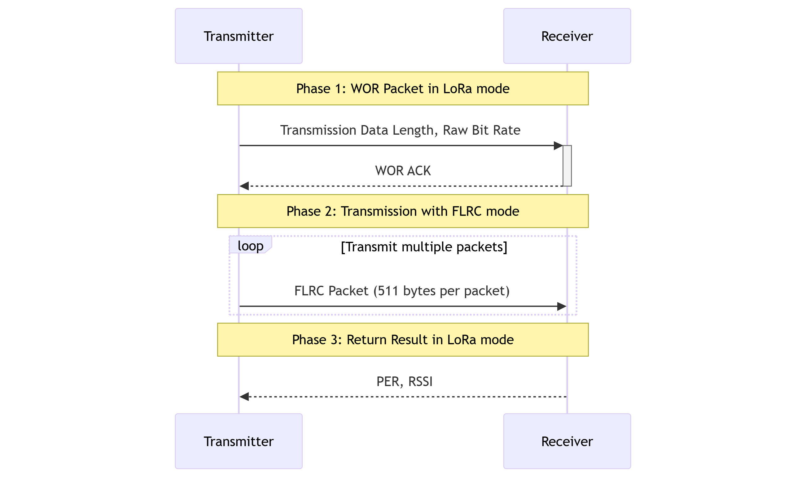
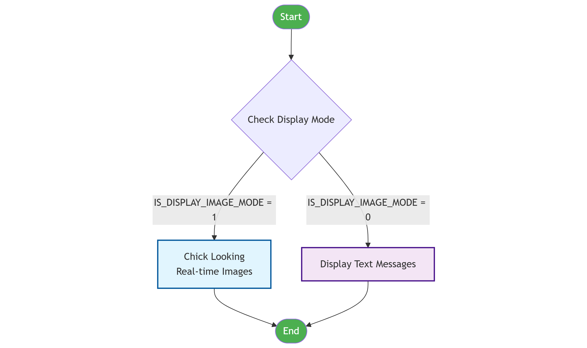
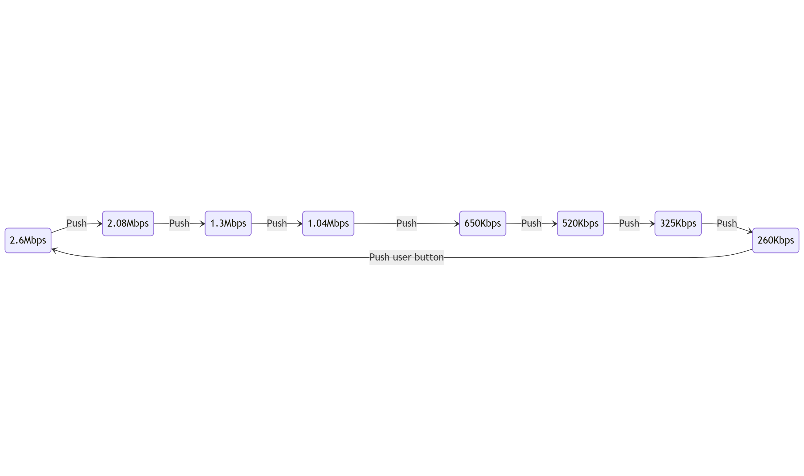

# Image Transfer Demo

## Overview

This demo aims to demonstrate the transmission images by using FLRC modulation. It runs on the set of hardware - MCU Xiao-nRF54L15 + LR2021-Wio radio (that uses the "Wio" interface) with the LoRa Plus Expansion Board from Semtech&copy;.

## Architecture

> This demo is based on preview releases "1.1.0-flrcpreview - UNSTABLE" of usp & usp_zephyr from Semtech&copy;.<br>
> **The FLRC feature is patent pending.**<br>
> ⚠️ **Warning**: This preview release is not intended for production use. A stable release will be available soon based on
> - [USP Zeyphyr](https://github.com/Lora-net/usp_zephyr.git)
> - [USP](https://github.com/Lora-net/usp.git)

Have a look on [west.yml](west.yml) and [CMakeLists.txt](CMakeLists.txt) for zephyr & usp_zephyr integration.

## Getting Started

### Install Zephyr

The following steps were tested for both Linux & Windows Development OS.

Install Zephyr following: https://docs.zephyrproject.org/latest/develop/getting_started/index.html. **This demo was built and tested with Zephyr RTOS v4.2 & Zephyr SDK v0.17.0.**

```bash
mkdir zephyr_workspace
cd zephyr_workspace
git clone https://github.com/Lora-net/swdm031_img_xfer.git
west init -l swdm031_img_xfer
west update
```

### Build

```bash
cd zephyr_workspace/swdm031_img_xfer
west build --pristine --board xiao_nrf54l15/nrf54l15/cpuapp
```

For this demo, there are two roles for devices, one is transmitter and the other is receiver. The default role is the transmitter. So, if you want to set it as the receiver, you can add the macro - `CONFIG_RECEIVER=y` as below when compiling or add it directly in the [prj.conf](prj.conf) file.

```bash
west build --pristine --board xiao_nrf54l15/nrf54l15/cpuapp -- -DCONFIG_RECEIVER=y
```

### Flash

The Xiao-nRF54 doesn't embed a J-Link interface, it is instead interfaced with a CMSIS-DAP interface. We recommend using `pyocd`, version >= 0.38.0 for both flashing and debugging. By default, `pyocd` should be included when installing Zephyr requirements. It will be intalled inside the venv. Use `pyocd --version` to check the installed version. Use `pip install pyocd` if it is not already installed. On Debian-based systems, you may need to install additional udev rules to be able to connect to the board. You might want to follow the instructions [here](https://github.com/pyocd/pyOCD/tree/main/udev) to install PyOCD known USB devices. Additionaly, you will have to manually install `99-xiao-nrf54l15.rules` file found in `usp_zephyr/boards/seeed/xiao_nrf54l15/support` using the same procedure.

After pyocd is ready, flash a binary from the demo directory. Run:

```bash
west flash
```

In case you want to flash with native pyocd command, you can run:

```bash
pyocd flash -t nrf54l build/zephyr/zephyr.hex # Replace build with your build folder name
```

In one situation, when you flash a binary, you don't want to plug and unplug frequently devices when you connect two devices at the same time. You can run the flash command as below.

```bash
# Check the connected device and get its 'UNIQUE_ID'
pyocd list
pyocd flash -t nrf54l build/zephyr/zephyr.hex -u UNIQUE_ID
```

If you encounter an error saying the the board is locked, run:

```bash
pyocd erase -c -t nrf54l
```

## Guides

### Main Macros

All the related macros that you may want to change for radio or application layer are located in [`src/common/apps_configuration.h`](src/common/apps_configuration.h) header file.

The following table is some explanations for main macros that are used.

| Macro                         | Description                                                                                                        |
| ----------------------------- | ------------------------------------------------------------------------------------------------------------------ |
| TX_OUTPUT_POWER_DBM           | Range(dBm): [-9, +22] for sub-GHz, [-19, 12] for 2.4GHz (HF_PA).                                                   |
| RF_FREQ_IN_HZ                 | Support sub-G and 2.4G                                                                                             |
| SLEEP_DELAY_MS                | The period of two main program loops. Radio goes into sleep mode. Default 3000 ms.                                 |
| MARGIN_RADIO_MS               | A margin for next radio operation. Default 20 ms.                                                                  |
| FLRC_RADIO_PAYLOAD_MAX_LENGTH | The payload length in FLRC packet. Default 511 bytes.                                                              |
| FLRC_PACKET_INDEX_LEN         | The first two bytes of each packet are the packet index. Default 2 bytes.                                          |
| IS_DISPLAY_IMAGE_MODE         | The display screen has two modes. 1: Show the real-time chick looking images. 0: Show the text results. Default 1. |

### Flowchart of main program

The following flowchart shows the main logic of this demo.


### Two display modes

The display screen has two modes for tests. It depends on the macro `IS_DISPLAY_IMAGE_MODE`. When it is set as 1, the real-time chick looking images will be displayed on the receiver's screen. When it is set as 0, the text results will be displayed on the receiver's screen, and also the testing data length, which it is `SET_TRANSMIT_DATA_SIZES`, can be modified any value less than **60KBytes**.


### User Button Usage

You can push the user button on the Xiao-nRF54L15 board, to change the used raw bit rate between transmitter and receiver. The change order is as follows.

